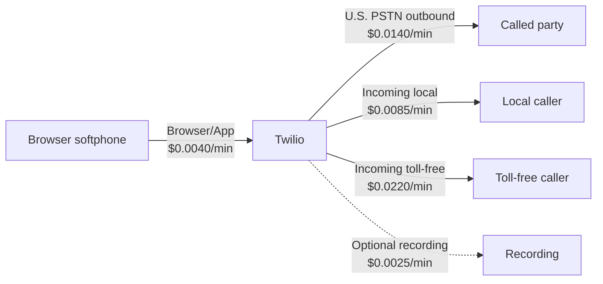

# YOURCOSTS — U.S. Softphone Pricing Blueprint

**Pricing checked:** 2026-09-24  
**Currency:** USD  
**Scope:** Twilio Programmable Voice and Programmable Messaging used by this softphone. Prices are current published pay-as-you-go rates, before taxes, account-specific discounts, and carrier pass-through fees where applicable.

## Executive summary

The softphone has two active, voice/SMS/MMS-capable U.S. numbers:

| Number            | Type                 | Current monthly lease | Main use seen in ledger                                         |
| ----------------- | -------------------- | --------------------: | --------------------------------------------------------------- |
| `+1 667-220-6726` | U.S. local long code |                 $1.15 | Browser outbound calling                                        |
| `+1 877-652-4532` | U.S. toll-free       |                 $2.15 | Browser outbound calling, inbound calls, voicemail, and SMS/MMS |

Their recurring number rent is **$3.30/month** before any usage.

For a U.S. call placed from the browser softphone, Twilio bills two connected legs: Browser/App to Twilio at $0.0040/minute and Twilio to the U.S. PSTN destination at $0.0140/minute. The working outbound rate is therefore **$0.0180 per billed minute**, or **$0.0205 per billed minute** when the call is recorded.

Twilio rounds **each completed call leg** up to a whole minute. A connected 61-second browser-to-PSTN call therefore normally bills two 2-minute legs, before any recording charge. [Twilio’s rounding policy](https://help.twilio.com/articles/223132307-How-do-you-round-minutes-for-billing-) documents this per-leg rounding.

## How this softphone is billed

The implementation uses the Voice SDK in the browser and returns TwiML `<Dial><Number>` for outbound calls. It uses `answerOnBridge="true"`, which keeps the browser leg ringing until the PSTN destination answers. Inbound calls similarly dial the browser first and then offer voicemail. That call-leg design matters for billing outcomes below.

## Current Voice rates

Twilio’s U.S. Voice price page lists Browser/App at $0.0040/minute, U.S./Canada calling at $0.0140/minute, local inbound at $0.0085/minute, toll-free inbound at $0.0220/minute, and recording at $0.0025/minute. [Official Voice pricing](https://www.twilio.com/en-us/voice/pricing/us)

| Event                                                             | Local number `+1667…` | Toll-free number `+1877…` | Rate used by this softphone                             |
| ----------------------------------------------------------------- | --------------------: | ------------------------: | ------------------------------------------------------- |
| Browser/App leg, connected                                        |           $0.0040/min |               $0.0040/min | Applies to every connected browser call leg.            |
| Outbound PSTN leg to a U.S. destination                           |           $0.0140/min |               $0.0140/min | Same destination price for either caller ID.            |
| **Completed outbound softphone call**                             |       **$0.0180/min** |           **$0.0180/min** | Browser/App + PSTN.                                     |
| Call recording                                                    |           $0.0025/min |               $0.0025/min | Applies only when the app enables recording.            |
| **Completed outbound softphone call with recording**              |       **$0.0205/min** |           **$0.0205/min** | Browser/App + PSTN + recording.                         |
| Inbound PSTN leg                                                  |           $0.0085/min |               $0.0220/min | Number type determines this rate.                       |
| Browser/App leg when an inbound call is answered in the softphone |           $0.0040/min |               $0.0040/min | Added only when the browser is bridged.                 |
| **Inbound call answered in browser**                              |       **$0.0125/min** |           **$0.0260/min** | Inbound PSTN + Browser/App.                             |
| **Inbound answered in browser and recorded**                      |       **$0.0150/min** |           **$0.0285/min** | Adds recording.                                         |
| **Missed inbound call that reaches voicemail**                    |       **$0.0110/min** |           **$0.0245/min** | Inbound PSTN + voicemail recording; no Browser/App leg. |

Recording storage is separate from recording creation. Twilio bills recording creation by the minute; recording storage only becomes billable after the project’s first 10,000 stored recording minutes, with current published storage pricing starting at $0.00050 per stored minute per month. [Recording cost policy](https://help.twilio.com/articles/223132527-How-much-does-it-cost-to-record-a-call-), [Voice storage pricing](https://www.twilio.com/en-us/voice/pricing/us)

## Direct answers about missed, ringing, and voicemail calls

### Do inbound calls I miss cost money?

**Usually yes in this softphone, if Twilio answers the caller or records voicemail.** The inbound workflow returns TwiML to ring the browser and, after its 30-second timeout, plays a greeting and uses `<Record>` to capture voicemail. That is an answered inbound call, so the incoming number’s rate applies. If the caller leaves a voicemail, the recording rate also applies.

- Missed call to the local number that reaches voicemail: **$0.0085 + $0.0025 = $0.0110 per billed minute**.
- Missed call to the toll-free number that reaches voicemail: **$0.0220 + $0.0025 = $0.0245 per billed minute**.
- There is no Browser/App charge when the browser never answers.

Twilio states that the only way to avoid answering and billing an inbound call is to return `<Reject>` as the first TwiML verb. This softphone intentionally does not do that because it rings the browser and provides voicemail. [Twilio `<Reject>` documentation](https://www.twilio.com/docs/voice/twiml/reject)

If a caller disconnects before Twilio establishes a completed, answered call leg, the final result can be `no-answer` or `failed` and have no voice-minute charge. The exact result is visible in the Twilio Call Log and invoice, which are authoritative.

### Do outbound calls that ring out cost money?

**No voice-minute charge is expected when every leg ends as `no-answer`, `busy`, `failed`, or `canceled`.** The current outbound `<Dial answerOnBridge="true">` configuration prevents the browser parent leg from bridging until the destination answers. Twilio states that those final statuses are not charged, while any related `completed` parent or child leg is charged. [Twilio call-status billing guidance](https://help.twilio.com/hc/en-us/articles/223132547-What-are-the-Possible-Call-Statuses-and-What-Do-They-Mean-), [Twilio `<Dial>` reference](https://www.twilio.com/docs/voice/twiml/dial)

This does not include a completed leg created by a different call-flow action. The invoice and Call Log decide the final billable result.

### Do outbound calls that hit voicemail cost money?

**Yes.** A voicemail system answers the PSTN leg, so Twilio marks the call `completed`. The browser and PSTN legs are then both connected and billable, even if no human hears the call or you do not leave a message.

- U.S. voicemail connection from this softphone: **$0.0180 per billed minute**.
- If the softphone’s Record Call toggle was on: **$0.0205 per billed minute**.

Completed calls include calls answered by a human, IVR, or voicemail. [Twilio’s call status reference](https://help.twilio.com/hc/en-us/articles/223132547-What-are-the-Possible-Call-Statuses-and-What-Do-They-Mean-)

## SMS, MMS, and RCS pricing

All SMS and RCS text is charged per segment. SMS/MMS and RCS carrier fees depend on the recipient’s carrier and are passed through by Twilio. The ranges below combine Twilio’s base price with the published U.S. carrier-fee range; actual carrier mix determines the final price. [Official U.S. SMS/MMS/RCS pricing](https://www.twilio.com/en-us/sms/pricing/us), [carrier-fee explanation](https://help.twilio.com/articles/360016571913)

### SMS and MMS for the active numbers

| Channel                   |                      `+1667…` local |                  `+1877…` toll-free | Notes                                                                            |
| ------------------------- | ----------------------------------: | ----------------------------------: | -------------------------------------------------------------------------------- |
| SMS outbound              |           $0.0118–$0.0133 / segment |           $0.0118–$0.0128 / segment | $0.0083 Twilio base + recipient-carrier fee.                                     |
| SMS inbound               |           $0.0083–$0.0118 / segment |           $0.0083–$0.0118 / segment | Carrier fee may be zero for some networks.                                       |
| MMS outbound              | Starts at $0.0290–$0.0320 / message | Starts at $0.0290–$0.0320 / message | $0.0220 base + carrier fee, before any media-size charge.                        |
| MMS inbound               |           $0.0165–$0.0265 / message |           $0.0200–$0.0300 / message | Toll-free inbound MMS has a higher $0.0200 base.                                 |
| Failed SMS/MMS processing |          $0.0010 / `Failed` message |          $0.0010 / `Failed` message | Applies only when final status is `Failed`; do not assume `Undelivered` is free. |

### RCS

RCS is **not currently configured or used by this phone-number softphone**. It needs an approved RCS Sender in a Messaging Service; it is not automatically enabled merely because these numbers can send SMS/MMS. U.S. RCS carrier onboarding includes third-party brand vetting and carrier onboarding charges whose amount is not listed as a universal public rate. [RCS U.S. guidelines](https://www.twilio.com/en-us/guidelines/us/rcs)

| RCS type                | Twilio base | Combined published carrier range | Billing unit |
| ----------------------- | ----------: | -------------------------------: | ------------ |
| Rich text outbound      |     $0.0083 |                  $0.0128–$0.0145 | Segment      |
| Rich text inbound       |     $0.0083 |                  $0.0083–$0.0128 | Segment      |
| Rich media outbound     |     $0.0220 |                  $0.0290–$0.0355 | Message      |
| Rich media inbound      |     $0.0165 |                  $0.0165–$0.0300 | Message      |
| RCS `Failed` processing |     $0.0010 |       Carrier fee may also apply | Message      |

## API, webhook, and optional feature costs

| Item                                                |             Cost in this softphone | Explanation                                                                                                                                                                                                                                                       |
| --------------------------------------------------- | ---------------------------------: | ----------------------------------------------------------------------------------------------------------------------------------------------------------------------------------------------------------------------------------------------------------------- |
| Standard Programmable Voice REST API calls          |                $0 separate API fee | Calls cost when they connect; the REST request, TwiML fetch, and status callback are not separately priced.                                                                                                                                                       |
| Voice Access Token minting / Voice SDK registration |                $0 separate API fee | Usage is represented by connected Browser/App minutes.                                                                                                                                                                                                            |
| Standard Programmable Messaging REST API call       |                $0 separate API fee | The billed unit is the SMS/MMS/RCS message or segment, plus carrier fees.                                                                                                                                                                                         |
| Recording status callbacks and MP3 downloads        |                $0 separate API fee | Recording creation and, beyond the free storage allowance, storage are billable.                                                                                                                                                                                  |
| Caller-ID inventory check                           |                $0 separate API fee | The softphone uses an `IncomingPhoneNumber.fetch()` validation cache, not a paid Lookup request.                                                                                                                                                                  |
| Messaging Engagement Suite / Compliance Toolkit     |   $0 in the present implementation | The application sends directly from the number and does not configure a Messaging Service feature. If enabled, each costs $0.015 per outbound message after the Engagement Suite’s first 1,000 monthly messages.                                                  |
| A2P 10DLC for `+1667…`                              | One-time and monthly campaign fees | Mandatory for U.S. application-to-person local-number SMS. Brand: $4.50 one-time for Sole Proprietor/Low-Volume Standard, or $46 for Standard; campaign vetting: $15 one-time; campaign monthly fee: $1.50 Low-Volume Mixed, $2 Sole Proprietor, or $10 Standard. |
| Toll-free verification for `+1877…`                 |       Not priced in this blueprint | Verification is required for U.S./Canada toll-free SMS delivery. The ledger’s outbound `Undelivered` records make this worth checking.                                                                                                                            |

The project’s message code sends directly with `from`, so it currently uses SMS or MMS based on whether media is supplied. It does not send through an RCS Sender or Messaging Service. The project’s AI/Vapi product has separate vendor economics and is outside this Twilio phone-number estimate.

The A2P figures are carrier/TCR pass-through registration fees and sit on top of SMS price and carrier fees. Select the campaign type from the actual use case before treating one as a budget commitment. [Twilio’s current A2P 10DLC fee schedule](https://help.twilio.com/articles/1260803965530-What-pricing-and-fees-are-associated-with-the-A2P-10DLC-service)

## Historical usage restated at today’s rates

These are **estimates**, calculated from the softphone database as of 2026-09-24 and restated at today’s public rate card. They are not a replacement for Twilio invoices: the database does not retain Twilio’s final price, all destination carriers, taxes, discounts, or every parent/child Call SID.

For completed browser outbound calls, the calculation mirrors each logged rounded call minute onto the Browser/App and PSTN legs. Their durations can differ slightly in Twilio’s invoice, so exact billed totals can vary.

### `+1 667-220-6726` — local

| Observed usage                                        |                                      Quantity | Current-rate calculation                  |            Estimate |
| ----------------------------------------------------- | --------------------------------------------: | ----------------------------------------- | ------------------: |
| Completed outbound calls                              |   31 calls; 3,351 seconds; 75 rounded minutes | 75 × ($0.0040 Browser/App + $0.0140 PSTN) |             $1.3500 |
| Outbound calls with no answer, failed, or busy result |                                      20 calls | No completed call leg                     |    $0.0000 expected |
| Completed Dial recordings                             | 4 recordings; 849 seconds; 16 rounded minutes | 16 × $0.0025                              |             $0.0400 |
| Inbound SMS                                           |                                1 text segment | $0.0083 + $0–$0.0035 carrier fee          |     $0.0083–$0.0118 |
| **Usage subtotal**                                    |                                               |                                           | **$1.3983–$1.4018** |
| Current monthly number lease                          |                                               | $1.15/month                               |     **$1.15/month** |

### `+1 877-652-4532` — toll-free

| Observed usage                             |                                                                      Quantity | Current-rate calculation                     |              Estimate |
| ------------------------------------------ | ----------------------------------------------------------------------------: | -------------------------------------------- | --------------------: |
| Completed outbound calls                   |                              605 calls; 50,246 seconds; 1,180 rounded minutes | 1,180 × ($0.0040 Browser/App + $0.0140 PSTN) |              $21.2400 |
| Outbound no answer, busy, or failed        |                                                                     261 calls | No completed call leg                        |      $0.0000 expected |
| Completed inbound calls                    |                                     69 calls; 726 seconds; 69 rounded minutes | 69 × $0.0220 toll-free inbound               |               $1.5180 |
| Confirmed answered browser inbound minutes |                                                             7 rounded minutes | 7 × $0.0040 Browser/App                      |               $0.0280 |
| Completed recordings                       | 80 files; 112 rounded minutes: 73 outbound Dial, 7 inbound Dial, 32 voicemail | 112 × $0.0025                                |               $0.2800 |
| Inbound SMS                                |                                                      78 messages; 81 segments | 81 × $0.0083 + $0–$0.0035 carrier fee        |       $0.6723–$0.9558 |
| Inbound MMS                                |                                                                    2 messages | 2 × $0.0200 + $0–$0.0100 carrier fee         |       $0.0400–$0.0600 |
| Outbound SMS                               |                                  23 text segments, including 18 `Undelivered` | 23 × $0.0083 + $0.0035–$0.0045 carrier fee   |       $0.2714–$0.2944 |
| **Usage subtotal**                         |                                                                               |                                              | **$24.0497–$24.3762** |
| Current monthly number lease               |                                                                               | $2.15/month                                  |       **$2.15/month** |

The 18 outbound `Undelivered` texts remain in the estimate because an unsuccessful final delivery does not by itself prove that Twilio or the carrier did not bill the attempted message. Reconcile those rows with the Twilio Message Logs and invoice before treating them as zero cost.

### Combined current-price view

| Category                                                     | Current-rate estimate |
| ------------------------------------------------------------ | --------------------: |
| Observed usage across the two active numbers                 | **$25.4480–$25.7780** |
| Recurring lease for both active numbers                      |       **$3.30/month** |
| Observed usage plus one current month of both number rentals | **$28.7480–$29.0780** |

The toll-free number was purchased on 2026-05-21. At five monthly $2.15 billing periods through 2026-09-24, its current-rate rental equivalent is about $10.75. The local number was purchased on 2026-09-13, so one current $1.15 period is a reasonable planning amount. This is a planning estimate only; Twilio invoices, not this calculation, determine actual rental timing, credits, prorating, taxes, and historical prices.

## Rental and cleanup watch list

Three additional local numbers exist in the project database with `active: false` and no recorded `releasedAt` date. Turning a number off in the softphone does not itself release it from Twilio. If any still exist in the Twilio Console’s Active Numbers inventory, each may add **$1.15/month**, or **$3.45/month** together, even while the UI prevents dialing from them. Confirm that inventory and release any number you no longer need.

## Reconciliation checklist

1. Use Twilio Console **Billing → Usage** and invoice line items as the source of truth.
2. Compare each completed call’s parent and child Call SID: both legs are separately rounded and billed.
3. Check the carrier attached to each SMS/MMS destination before using a single carrier-fee assumption.
4. Confirm toll-free verification for `+1 877-652-4532` and A2P 10DLC campaign status for `+1 667-220-6726` before production messaging.
5. Confirm whether the three locally inactive numbers remain leased, then release unneeded numbers to stop rental charges.

## Sources

- [Twilio Programmable Voice Pricing — United States](https://www.twilio.com/en-us/voice/pricing/us)
- [Twilio Voice billing rounding](https://help.twilio.com/articles/223132307-How-do-you-round-minutes-for-billing-)
- [Twilio voice call statuses and billing](https://help.twilio.com/hc/en-us/articles/223132547-What-are-the-Possible-Call-Statuses-and-What-Do-They-Mean-)
- [Twilio `<Dial>` reference](https://www.twilio.com/docs/voice/twiml/dial)
- [Twilio `<Reject>` reference](https://www.twilio.com/docs/voice/twiml/reject)
- [Twilio U.S. SMS, MMS, RCS, carrier, and number pricing](https://www.twilio.com/en-us/sms/pricing/us)
- [Twilio A2P 10DLC registration and campaign fees](https://help.twilio.com/articles/1260803965530-What-pricing-and-fees-are-associated-with-the-A2P-10DLC-service)
- [Twilio call-recording charges](https://help.twilio.com/articles/223132527-How-much-does-it-cost-to-record-a-call-)
- [Twilio U.S. RCS guidelines and onboarding fees](https://www.twilio.com/en-us/guidelines/us/rcs)
